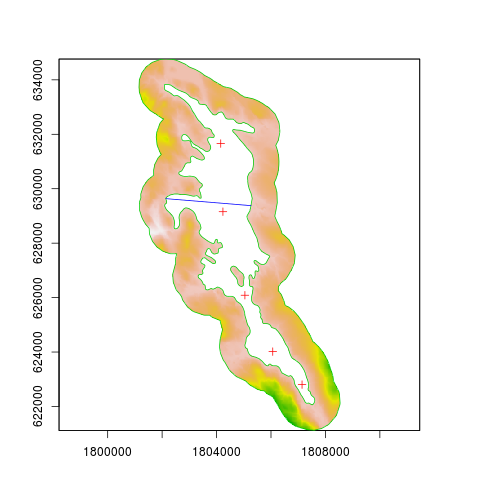
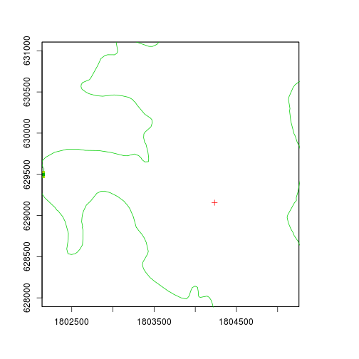
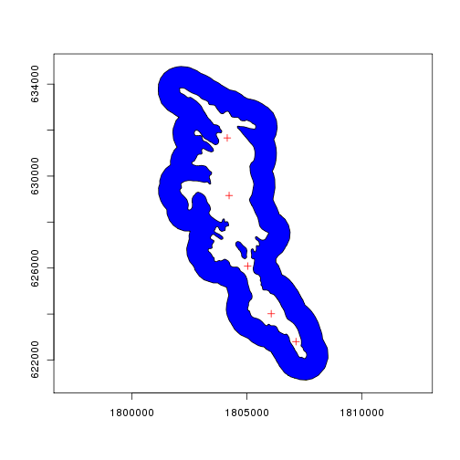
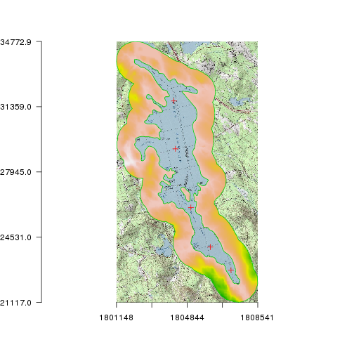
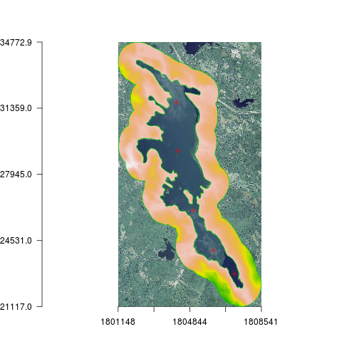

quickmapr
=========

[](https://travis-ci.org/jhollist/quickmapr)  [](https://ci.appveyor.com/project/jhollist/quickmapr) [](https://coveralls.io/github/jhollist/quickmapr?branch=master) 

[](http://dx.doi.org/10.5281/zenodo.33135)

[](http://cranlogs.r-pkg.org/badges/quickmapr)

There are many packages that already exist or are in active development that support the visualization of spatial data in R.  However, there seems to be a gap for those that need to quickly view, compare, and explore the results of a given spatial analysis. The current thinking behind `quickmapr` is to allow for quick visualization of `sp` and `raster` objects. 

Functionality for the current release is for easy mapping of multiple layers, simple zooming, panning, labelling, and identifying.  These tools are intended for use within an active spatial analysis workflow and not for production quality maps.

`quickmapr` is built as a series of wrapper functions for the default `sp` and `raster` plotting functions. Currently there are 10 commands.  As the idea behind this is to quickly map data, an emphasis was given to brevity of function names.  The commands are:

- `qmap()`: creates the map and controls options
- `zi()`: zooms in
- `zo()`: zooms out
- `ze()`: zoom in to an extent
- `p()`: pans
- `l()`: adds labels
- `i()`: identify features
- `f()`: returns to extent of originally created map
- `s()`: selects and returns spatial objects
- `m()`: measures distances on plot

A function for pulling in basemaps (aerials or topo-quads) from the USGS National Map is included but should be considered experimental.

Example data are available via:

- `data(lake)`

##Installation
To install the development version:


```r
install.packages("devtools")
library("devtools")
install_github("jhollist/quickmapr")
library("quickmapr")
```

To install from CRAN (curretnly version 0.1.1):


```r
install.packages("quickmapr")
library("quickmapr")
```

##Using Quickmapr (work in progress)
Basic usage of `quickmapr` is built around a `qmap` object which is simply a list of `sp` or `raster` objects and a recorded plot.  Most of the other `quickmpar` functions will work with a `qmap` object.

To create a qmap object:


```r
#First some data
data(lake)
#Create your first quick map and object
qm <- qmap(elev,samples,buffer,width)
```



There are some other options on `qmap` that let you change the draw order, coloring of vectors, extent of the map, and whether or not to preform a basic projection check (data are assumed to be in the same coordinate reference system).

So for instance, if you want to zoom in to the extent of one of your layers you could do something like:


```r
#Zoom to the extent of the layer named width
qm<-qmap(elev,samples,buffer,extent=width)
```



Currently this is only working with object in memory and not pulling from the `qmap` object.  

You can change colors (this is still a bit clunky).


```r
#draw samples and width in red and buffer with blue fill
qm<-qmap(elev,samples,buffer,order = c(2,1,3), colors = c("red","red","blue"), fill=TRUE)
```



Basemaps can be added from the USGS' National Map (still VERY experimental,slow,
and United States Specific)


```r
#Get a Topo Basemap
qm <- qmap(qm,basemap = "topo", resolution = 1000)
```



```r
#Get an Aerial Basemap
qm <- qmap(qm, basemap = "1m_aerial", resolution = 1000)
```



Identifying is accomplished with i() and returns different items depending on the type of spatial data.  


```r
#identify
i(qm,"samples")
i(qm,"lake")
```


Zooming and panning are accomplished with zi(),ze(),zo(),f(), and p():


```r
#Zoom in on selected point
zi(qm)
#Zoom in on a chosen extent
ze(qm)
#Zoom out form selected point
zo(qm)
#Go out to full extent
f(qm)
#pan
p(qm)
```


#EPA Disclaimer
The United States Environmental Protection Agency (EPA) GitHub project code is provided on an "as is" basis and the user assumes responsibility for its use.  EPA has relinquished control of the information and no longer has responsibility to protect the integrity , confidentiality, or availability of the information.  Any reference to specific commercial products, processes, or services by service mark, trademark, manufacturer, or otherwise, does not constitute or imply their endorsement, recommendation or favoring by EPA.  The EPA seal and logo shall not be used in any manner to imply endorsement of any commercial product or activity by EPA or the United States Government.


 
